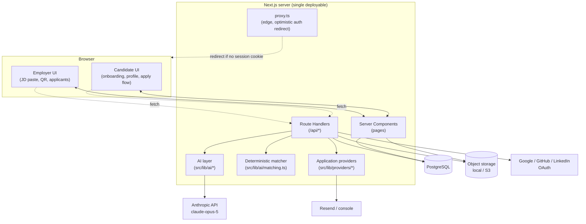
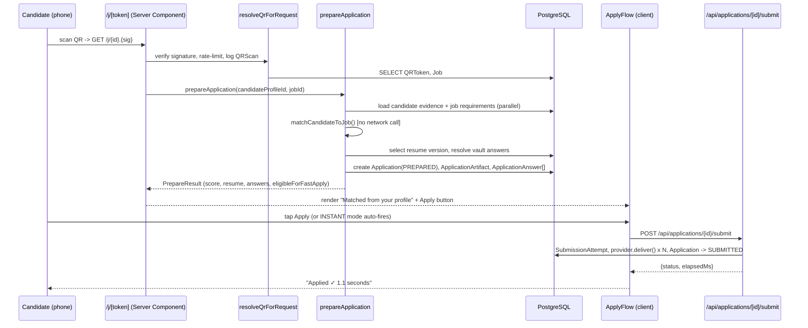
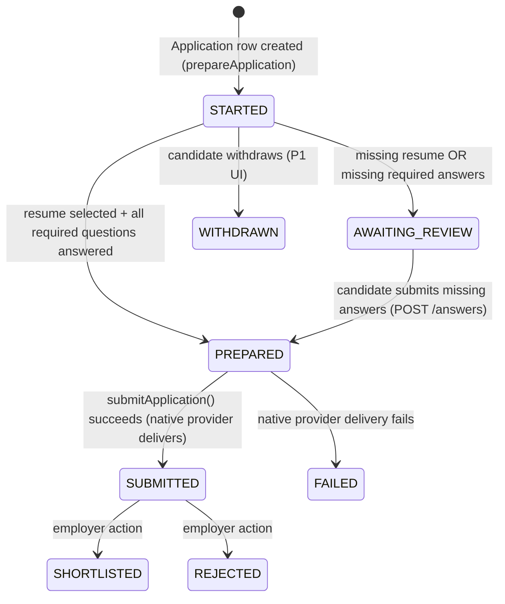
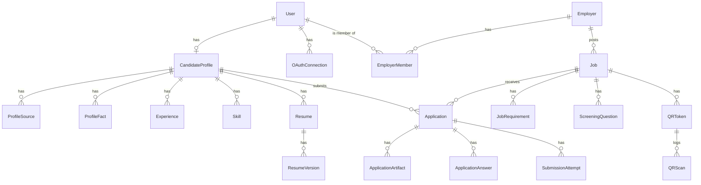

# QRify — System Architecture

See also: [PRODUCT_SPEC.md](./PRODUCT_SPEC.md) · [AI_SYSTEM.md](./AI_SYSTEM.md) · [SECURITY.md](./SECURITY.md) · [PRIVACY.md](./PRIVACY.md) · [RESEARCH.md](./RESEARCH.md) · [API.md](./API.md) · [ROADMAP.md](./ROADMAP.md)

## 1. Stack

| Layer | Choice | Why |
|---|---|---|
| Frontend + backend | Next.js 16 (App Router), React 19, TypeScript (strict) | One deployable, one language, Server Components remove a whole API-fetching layer for read paths. |
| Styling | Tailwind CSS v4 | Fast to write, no component-library lock-in for a product whose whole pitch is "not generic SaaS UI." |
| Database | PostgreSQL | Relational integrity matters here — evidence provenance, application state, foreign keys everywhere. |
| ORM | Prisma 7 (`prisma-client` generator + `@prisma/adapter-pg`) | Type-safe schema-as-code, migrations, works with any Postgres host. |
| Auth | First-party (DB-backed sessions, bcrypt, hand-rolled OAuth PKCE) | See [Auth](#4-authentication) — avoided a third-party auth library on purpose. |
| AI | Anthropic Claude (`claude-opus-5`) via `@anthropic-ai/sdk`, structured outputs (Zod schemas) | See [AI_SYSTEM.md](./AI_SYSTEM.md). |
| Storage | Pluggable: local filesystem (dev) / S3-compatible (prod) | `StorageProvider` interface — swap without touching callers. |
| Email | Pluggable: console logger (dev) / Resend (prod) | `EmailProvider` interface, same pattern. |
| PDF | `@react-pdf/renderer` | Pure-JS, no headless-browser dependency, works in serverless. |
| QR | `qrcode` npm package + HMAC-signed tokens | See [§6](#6-qr-architecture). |

Deliberately **not** used: Redis/a queue (nothing in the P0 flow needs async background processing — see [§5](#5-the-five-second-application-architecture)), a third-party auth provider (schema/OAuth-scope control mattered more than saving ~300 lines), an ATS SDK (none are wired for real in the MVP — see [RESEARCH.md](./RESEARCH.md)).

## 2. System diagram



## 3. Repository structure

```
qrify/
  prisma/
    schema.prisma        # full data model — see docs/DATABASE section below
    migrations/
  prisma.config.ts        # Prisma 7 config (datasource URL, migrations path)
  src/
    app/                  # Next.js App Router — pages + API routes
      api/                # Route Handlers (REST-ish JSON API — see API.md)
      candidate/          # candidate dashboard (Server Components)
      employer/           # employer dashboard
      j/[token]/           # the QR resolver + apply page — the money route
      login/ signup/ onboarding/
    components/
      candidate/ employer/ shared/   # Client Components (interactive bits)
    lib/
      ai/                 # extraction, matching, generation, factuality (see AI_SYSTEM.md)
      applications/       # prepare/submit orchestration, resume tailoring
      auth/               # session, password, OAuth, constants
      candidate/           # profile helpers, evidence loading, extraction application
      employer/            # employer access control, JD-extraction-to-DB writer
      email/ storage/       # pluggable provider interfaces + implementations
      integrations/         # GitHub sync (deterministic, not AI)
      pdf/                  # resume PDF render + PDF text extraction
      providers/            # ApplicationProvider adapters (native/email/stubs)
      qr/                   # signed token + QR image generation
      validation, crypto.ts, db.ts, audit.ts, rate-limit.ts
    proxy.ts               # edge middleware — optimistic auth gate only
  scripts/seed-demo.ts      # demo data (see docs/DEMO_SCRIPT.md)
  tests/                    # unit / integration / e2e
  docker-compose.yml         # local Postgres for engineers without a managed DB
  docs/                       # this folder
```

## 4. Authentication

**Decision: first-party, not a library.** Auth.js/NextAuth was evaluated; two things ruled it out for this MVP: (1) version risk against Next.js 16 + React 19 (this scaffold's own `AGENTS.md` warns training data is stale for this Next version — pinning behavior to a beta major version of a third-party auth library on top of that was more risk than the ~400 lines of first-party auth cost), and (2) QRify needs *exact* control over what's stored per OAuth connection (GitHub access tokens must be retrievable later for profile sync — most auth-library adapters treat OAuth as login-only and don't model "keep the token for API calls" cleanly against a custom schema).

- **Sessions**: opaque random token (32 bytes) in an `httpOnly`, `secure` (prod), `sameSite=lax` cookie. Server stores only `sha256(token)` (`Session.tokenHash`) — a DB leak doesn't yield usable session tokens. Revocable (`Session.revokedAt`), 30-day expiry.
- **Password auth**: bcrypt, 12 rounds.
- **Magic link**: single-use token, `sha256` stored, 15-minute expiry, generic response regardless of whether the address has an account (no user-enumeration oracle).
- **OAuth (Google, GitHub, LinkedIn)**: hand-rolled Authorization Code + PKCE (`src/lib/auth/oauth.ts`). We evaluated `arctic` (a popular OAuth client lib) and rejected it — npm flags it "no longer supported," and token-exchange code is exactly the kind of thing you don't want unmaintained. State + PKCE verifier round-trip through a short-lived `httpOnly` cookie, never trusted from anywhere else. Access/refresh tokens are AES-256-GCM-encrypted at rest (`src/lib/crypto.ts`) before being written to `OAuthConnection`.
- **Proxy (`src/proxy.ts`)**: checks *cookie presence only* — no DB call, per Next's own guidance that Proxy/Middleware shouldn't do full session validation. Real authorization happens in every Server Component / Route Handler via `getCurrentUser()`, which does hit the DB. This is an explicit two-layer design: Proxy is UX (don't flash a protected page before redirecting), `getCurrentUser()` is the actual gate.

## 5. The five-second application: architecture

This is the load-bearing decision in the whole system, so it's worth being explicit about how the promise is actually kept, because "call an LLM in the request path" would blow the budget immediately.

**Everything slow happens off the candidate's scan → apply path:**

| When | What runs | Latency budget |
|---|---|---|
| Employer pastes a JD | `extractJobDescription()` — one Claude call, structured output | A few seconds, employer sees a spinner. Cached onto `Job.extractedData` forever. |
| Candidate uploads a resume / finishes a voice session | `extractCandidateFactsFromResume` / `extractCandidateFactsFromVoice` — one Claude call each | A few seconds, candidate sees a spinner. Writes `Experience`/`Skill`/`Project`/... rows. |
| Candidate explicitly requests a tailored resume for a job (or a REVIEW-mode application needs one) | `generateTailoredResume()` + `checkResumeFactuality()` — two Claude calls | A few seconds, explicit user-triggered action, never blocks a scan. |
| **Candidate scans a QR** | `resolveQrForRequest()` (DB) → `prepareApplication()` (DB reads + **deterministic** matching, `src/lib/ai/matching.ts`) → render | No LLM call. Measured `serverPrepareMs` in local testing: **~50ms.** |
| **Candidate taps Apply** | `submitApplication()` — DB writes + provider `.deliver()` (native = no-op, email = one `fetch`) | No LLM call. |

The deterministic matcher (`matchCandidateToJob`) does keyword/synonym overlap between the candidate's evidence terms and the job's requirement labels — no network call, no model. It is *less* clever than an LLM-based matcher, and that's the point: it's fast, free, and fully explainable (every match traces to one `Skill`/`Experience`/`Project` row — see `matchedEvidence` in `MatchResult`). An LLM-generated narrative explanation of the *same* match (`generateMatchExplanation`) exists for the recruiter dashboard, but runs async, never blocking the candidate.

**Resume selection at scan time is also non-generative**: `selectResumeVersion()` picks (in order) an existing tailored `ResumeVersion` for this exact job → the candidate's `MASTER` resume → any uploaded resume. If none exists, the application can't reach `eligibleForFastApply` and the candidate sees a prompt to add a resume — this is the honest boundary described in [RESEARCH.md § Negative Results](./RESEARCH.md#negative-results--designed-for-limits): **a candidate with zero profile data cannot get a five-second application, by design** — the promise is for a *returning* candidate with an established profile, exactly as the product brief specifies ("returning candidate... whenever the application does not require additional mandatory information").

Real measured numbers (local dev, seeded candidate, `ONE_TAP` mode, curl + Playwright): server-side prepare ≈ 55ms; full scan-to-"Applied✓" including a real browser click ≈ **1.1 seconds.** See `docs/DEMO_SCRIPT.md`.

### Sequence



## 6. QR architecture

The QR image encodes `{APP_URL}/j/{qrTokenId}.{signature}` — never raw candidate or job data (`src/lib/qr/token.ts`, `src/lib/qr/generate.ts`).

- `qrTokenId` is a Prisma `cuid` (the `QRToken` row's primary key) — already high-entropy, not sequential, not guessable.
- `signature = HMAC-SHA256(qrTokenId, QR_TOKEN_SECRET)`, base64url. The resolver recomputes and compares with `timingSafeEqual` — a tampered or guessed id fails in O(1), before any DB query, before rate limiting even matters.
- **Revocation**: `QRToken.revoked` — flips the token dead without changing the URL printed on a poster.
- **Stability under edits**: the QR encodes the *token id*, not job content — an employer editing location/compensation/questions never invalidates a printed QR (`selectProviders`/`prepareApplication` always read the live `Job` row).
- **Rate limiting**: per-`(qrTokenId, dailyHashedIP)` fixed window (20/min) — see `src/lib/rate-limit.ts`, an in-memory limiter explicitly flagged as single-instance-only (P1: Upstash Redis, see [ROADMAP.md](./ROADMAP.md)).
- **Anti-enumeration**: IPs are never stored raw — `hashIp()` salts + daily-buckets before writing `QRScan.ipHash`.
- **Types**: `APPLY` (implemented), `MESSAGE` / `APPLY_INTRO` (schema + AI draft-generation exist — `src/lib/ai/outreach.ts` — UI wiring is a P1 item, see ROADMAP).

## 7. Application state machine



## 8. Application execution layer (providers)

`src/lib/providers/` implements the `ApplicationProvider` interface from the product spec exactly:

```ts
interface ApplicationProvider {
  type: "QRIFY_NATIVE" | "ATS_API" | "EMAIL" | "REDIRECT_PREFILL" | "BROWSER_ASSIST";
  availability: "AVAILABLE" | "NOT_IMPLEMENTED";
  canHandle(job): boolean;
  getMissingFields(input): string[];
  deliver(input): Promise<DeliverResult>;
}
```

| Provider | Status | What it does |
|---|---|---|
| `QRifyNativeProvider` | **Real, mandatory** | No-op beyond the DB writes `applications/service.ts` already made — the application is immediately visible in the employer's QRify inbox. Runs for every job, always. |
| `EmailApplicationProvider` | **Real, supplementary** | If `Job.recruiterEmail` is set, sends a formatted notification email via the pluggable `EmailProvider`. Runs *alongside* native, never instead of it. |
| `AtsApiProvider` | **Stub** (`NOT_IMPLEMENTED`) | `canHandle()` always returns `false` — no ATS `Integration` ever reaches `CONNECTED` in this MVP. See RESEARCH.md for why (commercial partnership required per ATS). |
| `RedirectPrefillProvider` | **Stub** | Same — most ATS public apply forms don't expose a documented prefill contract. |
| `BrowserAssistProvider` | **Stub, intentionally never real** | Would require CAPTCHA/anti-bot bypass to do anything real — out of scope permanently, not just for the MVP. `deliver()` explains why if ever called. |

Stubs exist (rather than being omitted) so the interface is complete and testable, per the explicit "clearly labeled adapter/mock" requirement — see `src/lib/providers/stubs.ts`'s file comment.

## 9. Data model

Full schema: [`prisma/schema.prisma`](../prisma/schema.prisma) (32 models). Key structural decisions:

- **`ProfileFact` is a generic evidence ledger** — every AI-extracted or manually-entered fact about a candidate is *also* recorded here with `source`, `confidence`, `verificationStatus`, independent of the strongly-typed `Experience`/`Skill`/`Project`/... rows it produced. This is what "every generated claim must map to evidence" (product ethics requirement) is built on — the AI layer retrieves from this graph rather than "remembering."
- **`Resume` / `ResumeVersion`** are split: `Resume` is a named slot ("Master resume", "Senior Backend Engineer (tailored)"), `ResumeVersion` is an immutable, numbered revision with a storage key. Nothing is ever overwritten — a new tailored generation is a new version.
- **`ApplicationArtifact`** is the immutable "what exactly did we send" record — a resume version reference + snapshot content, created at prepare time, never mutated after submission. This is what candidate's "View what was sent" (`/candidate/applications/[id]`) reads.
- **`CandidateAnswer`** (the answer vault) only auto-fills a screening question when `approvedForReuse = true` — set only by explicit candidate action (onboarding pre-approval or a REVIEW-mode submission with "save to vault" checked). See PRIVACY.md § Consent-by-action.
- **Soft deletion** (`deletedAt`) on `User`, `CandidateProfile`, `Employer`, `Job`, `Resume`, `Experience`/`Education`/`Project`/`Certification` — supports the privacy requirement to disconnect a source / delete data without breaking `AuditEvent` referential history.



## 10. Non-Next.js integration surfaces

- **AI**: `src/lib/ai/client.ts` — single choke point for every Anthropic call. See [AI_SYSTEM.md](./AI_SYSTEM.md).
- **GitHub sync**: `src/lib/integrations/github-sync.ts` — deterministic (not LLM-extracted), reads `/user/repos` with only `read:user user:email` scope (no elevated `repo` scope needed — public repos are readable with basic auth alone).
- **Storage / Email**: interface + swappable implementation, selected by `STORAGE_DRIVER` / presence of `RESEND_API_KEY` env vars. See `src/lib/storage/`, `src/lib/email/`.

## 11. What this build deliberately does not include

See [ROADMAP.md](./ROADMAP.md) for the full P1/P2 backlog. The short version: real ATS integrations (Greenhouse/Lever/Ashby/etc. — commercial partnerships, not an engineering gap), a background job queue (nothing in the P0 flow needs one), embeddings-based semantic matching (keyword/synonym matching was sufficient and is more explainable), and multi-instance-safe rate limiting (in-memory limiter flagged for an Upstash Redis swap).
