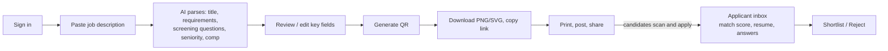

# QRify — Product Spec

## Thesis

"I can pay anyone in India in under five seconds by scanning a QR code. Why can't I tell a recruiter I'm interested in five seconds?"

Two actions, everything else exists to make them possible:

```
EMPLOYER:  PASTE JOB DESCRIPTION → GENERATE QR
CANDIDATE: SCAN QR → APPLY
```

## MVP model selection (of the 9 models considered)

**Candidate-first, QRify-native-first, hybrid long-term.** See [RESEARCH.md § Alternative execution-model comparison](./RESEARCH.md#alternative-execution-model-comparison-product-decision-record) for the scored comparison. In short: the core loop (native application + native employer inbox) needs zero external dependencies to work end-to-end, which is what let this MVP actually ship a working demo rather than stall on an ATS partnership. ATS-API and redirect-prefill are the P1 layer added *on top of* the working core, never a prerequisite for it.

## Information architecture

**Candidate**: `HOME · PROFILE · RESUMES · APPLICATIONS` (`src/app/candidate/layout.tsx`)
**Employer**: `JOBS` (+ per-job `APPLICANTS` inline, not a separate top-level nav item — see note below)

> Deviation from the brief's literal "JOBS, APPLICANTS" nav: applicants are scoped to a job in this MVP (view them from inside a job's detail page) rather than a global cross-job inbox. A global applicants view is a small, well-scoped P1 addition (the query pattern already exists in `/api/employer/jobs/[id]/applicants`, it just needs an "all my jobs" variant) — listed in ROADMAP rather than silently added under time pressure.

## Candidate journey

```mermaid
flowchart LR
    A[Sign up\nemail/password, magic link, Google, GitHub] --> B[Onboarding]
    B --> C[Connect: resume upload + GitHub sync]
    C --> D[Voice capture\n7 prompts, speak or type]
    D --> E[Review extracted profile]
    E --> F[Choose consent mode\nREVIEW / ONE_TAP / INSTANT]
    F --> G[Ready to scan]
    G -->|scans any QRify job QR| H[Apply screen\nmatched evidence + resume]
    H --> I[Tap Apply / auto-submit]
    I --> J[Applied ✓\napplication history + audit trail]
```



Implemented: `/signup`, `/onboarding` (`src/components/candidate/onboarding-flow.tsx`), `/candidate/*`, `/j/[token]`.

## Employer journey



Implemented: `/employer/jobs/new`, `/employer/jobs/[id]` (parse review + QR generation + applicant list + shortlist/reject, all on one page — see `src/components/employer/job-detail.tsx`).

## Consent modes

| Mode | Behavior | Default? |
|---|---|---|
| `REVIEW` | Every generated material is shown before submission; missing answers block submit until filled. | No |
| `ONE_TAP` | Everything is prepared automatically; candidate taps Apply once. | **Yes**, per the brief's guidance ("default new users to ONE_TAP unless a stronger privacy reason") |
| `INSTANT` | If `eligibleForFastApply` is true (resume present, all required questions resolved from the vault, no failed factuality check on the selected resume), scanning submits automatically with no tap. | No — opt-in only |

Set at onboarding, changeable anytime from `/candidate/profile` (`ProfileEditor` component). Every change is written to `AuditEvent` (`consent.changed`).

## The five-second application — candidate-visible experience

What the candidate actually sees (`src/components/candidate/apply-flow.tsx`), matching the brief's T+0…T+5 framing:

1. Scan → page loads (server-side: token verify, rate limit, scan log, evidence load, deterministic match, resume selection — all in one request, ~50ms of actual compute measured locally).
2. Screen shows: company, role, match percentage, up to 5 matched requirements with which profile evidence produced them, resume status ("Ready to send" + preview link).
3. `ONE_TAP`: one button, "Apply →". `INSTANT` + eligible: fires automatically on mount, shows "Applying…" then the result.
4. Result: "Applied ✓" + measured elapsed seconds + "View what was sent" link to the immutable artifact record.
5. If required questions are unanswered or no resume exists, the screen instead shows a short inline form (only the missing pieces, not a full re-application) — this is the `AWAITING_REVIEW` path, not a dead end.

## UX principles actually followed

- No giant forms on the apply path — the only form a returning candidate ever sees mid-apply is for genuinely missing required answers, and only those fields.
- No dashboard clutter — candidate nav is 4 items, employer nav is 1 (+ new-job CTA).
- No AI-chat-everywhere — the only conversational surface is the voice-capture onboarding step, and it's prompt-driven, not open-ended chat.
- Progressive disclosure in onboarding (connect → voice → review → consent) rather than one long form.
- The QR is visually central on the employer job page — it's the artifact employers are meant to print/share, not buried in a settings tab.

## Acceptance test (from the brief, § 34) — status

| Step | Status |
|---|---|
| Recruiter pastes a JD, QRify parses it | ✅ verified live (`/employer/jobs/new` → Claude structured extraction → `JobRequirement`/`ScreeningQuestion` rows) |
| Recruiter clicks Generate QR, QR appears | ✅ verified live, screenshot in DEMO_SCRIPT.md |
| Candidate scans, QRify recognizes candidate + job | ✅ verified live |
| QRify selects relevant evidence, selects a resume | ✅ verified live — 100% match score, 5 matched requirements shown with source evidence |
| Candidate taps Apply, submission completes | ✅ verified live — "Applied ✓ 1.1 seconds" (real measured time, local network) |
| Recruiter dashboard instantly receives the candidate | ✅ verified live — applicant appeared with match score, Shortlist/Reject actions |
| Recruiter opens submitted resume | ✅ implemented (`/api/files/[...key]`, authenticated) |
| Candidate application history contains the exact submitted artifact | ✅ implemented (`/candidate/applications/[id]`) |

The one caveat: the *AI-generation* legs of the pipeline (JD parsing quality, resume tailoring, factuality checking) are coded and request-shape-validated against the real Anthropic API (see RESEARCH.md), but not exercised against real model output in this session — the sandbox's Anthropic key had no credit. The demo above used seed data inserted directly (bypassing the LLM calls) specifically so the *product mechanics* could be verified live without being blocked on API credit. Whoever continues this should re-run the JD-paste flow with a funded key as the first validation step.
